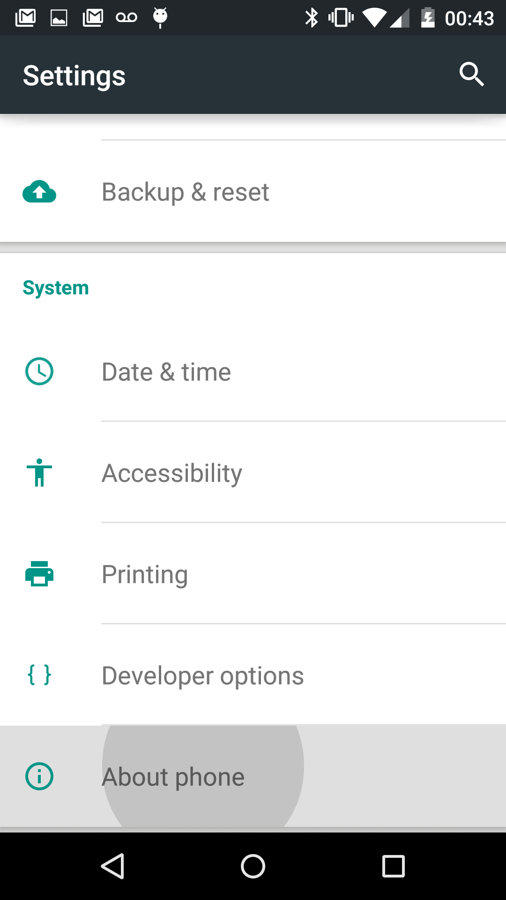
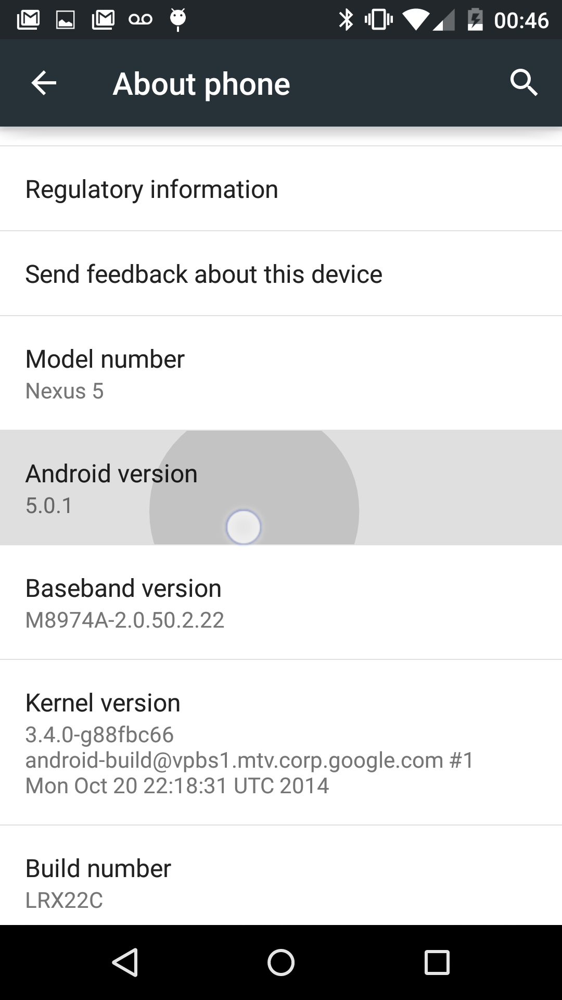
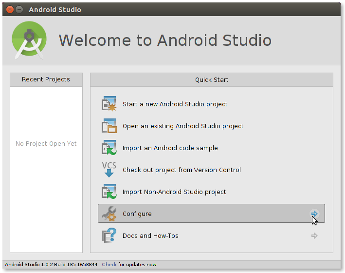

# Installing the right SDK for your Phone.md

1) version of android

2) enable developer mode (usb debugging on)

3) downloading the right files (if before lollipop)

## finding out which version of Android you have

You will need to check which version of Android you have, e.g., Jelly Bean (18 aka 4.2), KitKat (19 aka 4.3), or Lollipop (20 aka 5+)

**1) open "Settings" on your phone**

**2) scroll down to where it says "About Device"**

 

**3) look for your Android Version**

 

**3.5) if you would like to see the name, just tap "Android Version" a lot to reveal your dessert/mascot.**

 

**4) write that number (or mascot) down** :thumbsup:

## Enable Developer Mode

**1) open "Settings" on your phone**

**2) scroll down to where it says "About your Phone"**

 

**3) Tap on this, and tap on the kernel version a lot, and you will activate :sparkles:Developer Mode:sparkles**

**4) Open your new Developer Mode options from settings, and click on "Enable USB Debugging" that's important** :smiley:

 

## Download files

**1) Close all projects and Re-open Android Studio**

**2) When you reopen Android Studio, select Configure**

 

**3) ...then click SDK Manager

 

**4) Click the highest number of your version under "Tools" (shown here is Kitkat, aka version 19)**

 

**4.5) Then scroll down and click on only the first item in that version's folder (shown here is Kitkat)**

 

**6) Click Install**

 

**4) In the new window, select okay, agree to terms, and carry-on**

 

